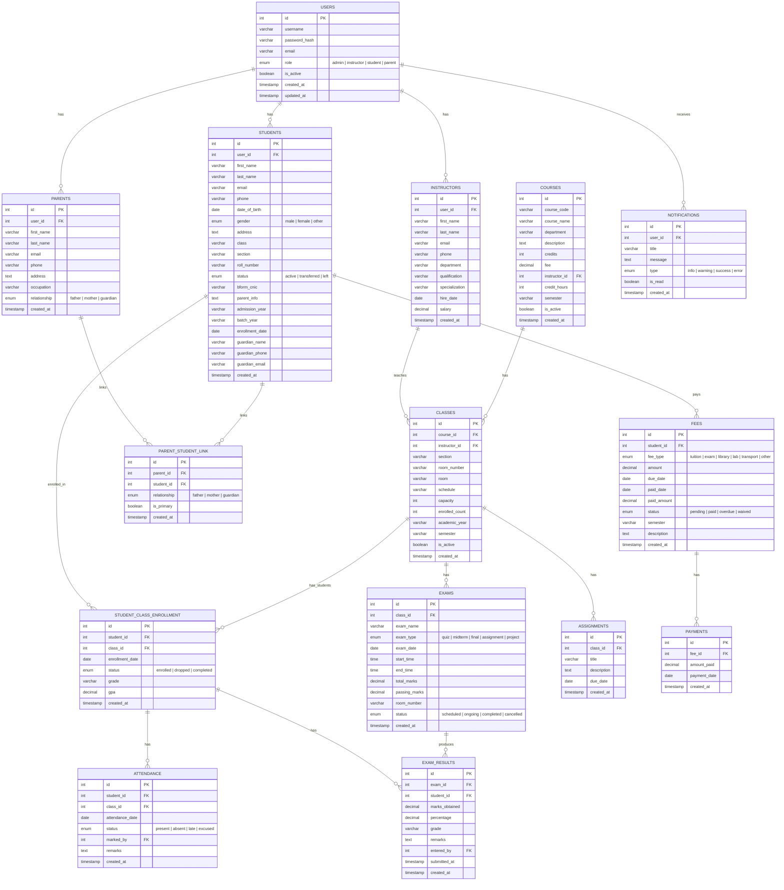

# Entity Relationship Diagram

## FAST University Academic Management System

## Key Relationships

| Relationship | Type | Description |
|---|---|---|
| Users → Students/Instructors/Parents | 1:1 | Each role profile links to a user account |
| Parents ↔ Students | M:N | Via `parent_student_link` junction table |
| Courses → Classes | 1:N | Each course has multiple sections |
| Classes → Student Enrollment | 1:N | Students enroll in class sections |
| Classes → Exams | 1:N | Exams belong to specific class sections |
| Exams → Results | 1:N | Each exam produces results per student |
| Students → Fees | 1:N | Fee records per student per semester |
| Students → Attendance | 1:N | Daily attendance per class |

## Normalization Notes

- **3NF Compliant**: No transitive dependencies
- **Junction Tables**: `parent_student_link` and `student_class_enrollment` resolve M:N relationships
- **Referential Integrity**: All foreign keys enforce CASCADE or SET NULL on delete
- **Indexing**: Performance indexes on frequently queried columns (email, department, status, dates)
